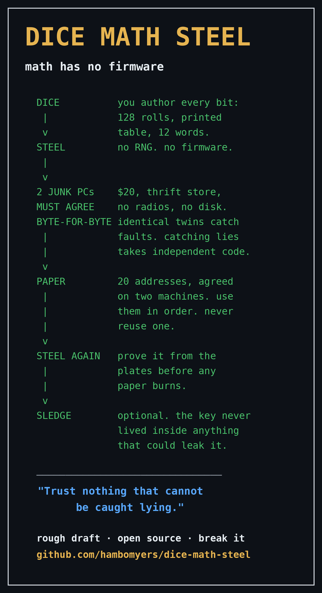

A ground-up minimal rewrite is underway on the v0.5-minimal branch;
v0.3.4 remains the reviewed reference until v0.5 code ships.

# Dice Math Steel

**math has no firmware.**

*Cold storage with no trusted devices. A rough draft posted to be
attacked, corrected, and improved — in reply to July 30, 2026, the
day the most trusted hardware wallet in Bitcoin cost its users ~$38M
because its firmware silently generated weak randomness for five
years.*

> ⚠️ **EXPERIMENTAL — UNREVIEWED — DO NOT USE WITH REAL FUNDS.**
> Signet or throwaway amounts only until strangers smarter than us
> have broken and repaired this. That's not a disclaimer, it's the
> development model.



## The idea

The July failure wasn't a bug in a product; it was a flaw in a
paradigm — trusting devices with the one step nobody can verify
from outside: randomness. So this protocol removes the device from
the one place it was ever dangerous:

1. **Physics authors the secret.** You derive all 128 seed bits
   yourself with dice and a printed table. No RNG, no firmware, no
   vendor in the room.
2. **Machines are cross-examined, never trusted.** Silent
   computations run on two unrelated junk computers and must match
   byte-for-byte. Honesty about what that buys: two identical
   machines are a fault detector, not a lie detector — two copies
   of the same CD-R image will agree on the same wrong answer.
   Catching lies takes independent implementations, which is why
   the signing milestone (roadmap 3) requires two independent
   codebases with byte-identical output — a hard requirement, not
   an option.
3. **Hardware is worthless, capability-stripped, and short-lived.**
   $20 thrift-store machines with no radios and no disk, holding
   the secret only in RAM, only for minutes, then destroyed.

One distinction runs the whole ceremony: loud versus silent
outputs. A loud output fails visibly — a wrong 12th word is an
invalid checksum every wallet on earth rejects — so it needs one
machine. A silent output looks right when it is wrong — address
derivation, signing — so it needs two, byte-identical or stop.

```
DICE  ·  MATH  ·  STEEL
          "trust nothing that cannot be caught lying"

           the one rule:  LOUD steps → one machine
                          SILENT steps → two machines
                          (identical twins catch FAULTS;
                           catching LIES needs independent code)

 ┌──────────────────────────────────────────────────────────┐
 │ 1 AUTHOR      physics writes the key                     │
 │               dice + printed table → all 128 bits, by    │
 │               hand. zero chips in the room.              │
 └────────────────────────────┬─────────────────────────────┘
                              ▼
 ┌──────────────────────────────────────────────────────────┐
 │ 2 FORCED MOVE                                  [LOUD]    │
 │               one junk PC names word 12. it has zero     │
 │               choices — a wrong answer is an invalid     │
 │               mnemonic every wallet on earth rejects.    │
 │               loud failure → one machine suffices.       │
 └────────────────────────────┬─────────────────────────────┘
                              ▼
 ┌──────────────────────────────────────────────────────────┐
 │ 3 DERIVE      xpub + first addresses          [SILENT]   │
 │               a wrong address looks right. so: two       │
 │               unrelated junk PCs, byte-identical or      │
 │               stop. (this catches faults; the signer     │
 │               roadmap requires independent code to       │
 │               catch lies.)                               │
 └────────────────────────────┬─────────────────────────────┘
                              ▼
 ┌──────────────────────────────────────────────────────────┐
 │ 4 STEEL       stamp the 12 words. every factor ×2 —      │
 │               no single fire, flood, or forgotten        │
 │               hole is fatal.                             │
 │               passphrase: optional, diced, also ×2.      │
 │               (no checksum exists for it — see 5.)       │
 └────────────────────────────┬─────────────────────────────┘
                              ▼
 ┌──────────────────────────────────────────────────────────┐
 │ 5 PROVE FROM STEEL — before burning any paper            │
 │               read the plates, not the paper. re-derive  │
 │               address #1 in a SECOND wallet app. match?  │
 │               only now do secrets burn.                  │
 │               (paper-sourced checks are circular.)       │
 └────────────────────────────┬─────────────────────────────┘
                              ▼
 ┌──────────────────────────────────────────────────────────┐
 │ 6 PAPER       20 receive addresses, hand-copied,         │
 │               verified once → trusted forever. use       │
 │               them in order; never reuse one. no         │
 │               screen in the receive path again.          │
 └────────────────────────────┬─────────────────────────────┘
                              ▼
 ┌──────────────────────────────────────────────────────────┐
 │ 7 DEATH       power off. RAM fades. (sledge optional —   │
 │               ritual, not load-bearing.)                 │
 └────────────────────────────┬─────────────────────────────┘
                              ▼
 ┌──────────────────────────────────────────────────────────┐
 │ 8 YEARS LATER two junk PCs sign the same PSBT with TWO   │
 │               INDEPENDENT programs (roadmap M3).         │
 │               same program twice → caught a fault.       │
 │               independent code agreeing → caught a liar. │
 │               rehearse annually: self-error, not theft,  │
 │               is how bitcoin dies.                       │
 └──────────────────────────────────────────────────────────┘

     coercion (wrench attack): see HARDCORE — duress/decoy
     passphrase, cryptographically deniable. deliberate
     choice, not a default.
```

The full ceremony, phase by phase, with honest status flags for
what this repo's code covers today: **[PROTOCOL.md](PROTOCOL.md)**.

## Quick start (10 seconds of due diligence)

    python3 dice2words.py --test

Runs this code against the official BIP39 reference vectors,
including a round-trip proof that the kitchen-table hand protocol
and standard BIP39 are the same mathematics. If it doesn't pass,
don't use it. Don't trust us either way — read the file; it's short
on purpose.

Then:

    python3 dice2words.py finish   # your 11 words + 7 bits -> word 12
    python3 dice2words.py check    # proofread any 12-word mnemonic

`table.txt` is the printable dice-to-word lookup table (11 rolls
per word; 1,2,3 → 0, 4,5,6 → 1; match the pattern, take the word).

## Why the machine only gets the last word

A 12-word mnemonic is 128 entropy bits + a 4-bit checksum. The
first 11 words and 7 bits of word 12 — all 128 entropy bits — come
from your dice. The checksum (first 4 bits of SHA-256 of your
entropy) determines the rest of word 12, and once your dice have
spoken there is exactly ONE legal final word. The machine names it
or is provably wrong: a wrong answer is an invalid mnemonic every
wallet on earth rejects. The checksum contains no secret — it's a
typo detector, not a lock. Author vs. proofreader, made literal.

## Design decisions we expect to defend

- **Direct dice→bit mapping, no hash-whitening.** Dice bias flows
  into the key; we accept that because casino dice keep bias small
  and non-adversarial, while machine-authored keys are exactly the
  adversarial category this protocol exists to escape. The tally
  test catches gross defects only — small bias is tolerated, not
  measured (see PROTOCOL.md Phase 1). Most attackable decision in
  the repo — see HARDCORE.md §2 and attack it.
- **12 words only.** 128 bits is sufficient; two modes is twice the
  mistakes. 24-word patch belongs in `experiments`.
- **Python runtime is a known, stated trust.** ~150 lines of ours
  sit on millions of CPython's. The defense is dual-machine
  cross-examination, not pretending the audit surface is 150 lines.
  Smaller-runtime ports are HARDCORE.md §4.

## Roadmap (help wanted, in order)

1. ~~Dice → mnemonic with human authorship~~ (v0.2, done)
2. BIP32/BIP84 derivation + address generation — same style: tiny,
   stdlib-only, vector-tested (closes PROTOCOL.md Phase 5's gap)
3. PSBT signing with RFC 6979 deterministic nonces, byte-identical
   across two independent implementations — hard requirement, not
   an option: identical copies only catch faults (closes Phase 7)
4. Bootable 32-bit live-CD image that runs all of it on
   twenty-year-old junk
5. Review. Especially review. **Break this.**

See CONTRIBUTING.md for how, SECURITY.md for exploitable findings,
HARDCORE.md for the extreme-variant agenda (`experiments` branch).

## Prior art, credited gladly

The Glacier Protocol (paranoid procedural cold storage), SeedSigner
and Krux (stateless DIY signing), SeedPicker and the printed
dice-table tradition, and the community's long-standing dice-seed
practice — which is exactly what protected people on July 30.

What this draft adds is the system: hand-authored entropy with the
machine demoted to proofreader; deliberately worthless heterogeneous
hardware as a supply-chain defense (nobody counterfeits junk, nobody
pre-positions an implant in a random dead thrift-store PC);
dual-machine byte-identical determinism, honestly bounded — a
fault detector until the implementations are independent;
write-once CD-R as immutable software distribution; RAM-only key
ephemerality; paper as the permanent root of truth for receiving;
and a vendor model that ships no electronics at all.

## Credits

v0.3's changes come from post-launch adversarial review (red-team
audit → adjudication → steelman). Critics are credited here by name
or handle as their findings land.

## License

MIT — see LICENSE. Take it, fork it, sell it, break it.
Attribution appreciated; correction appreciated more.
